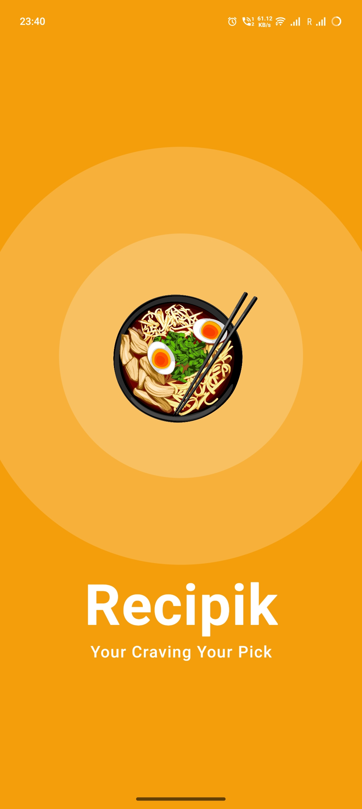
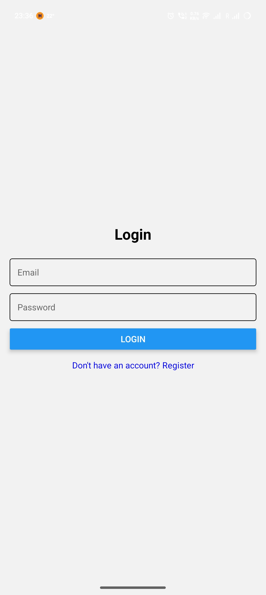
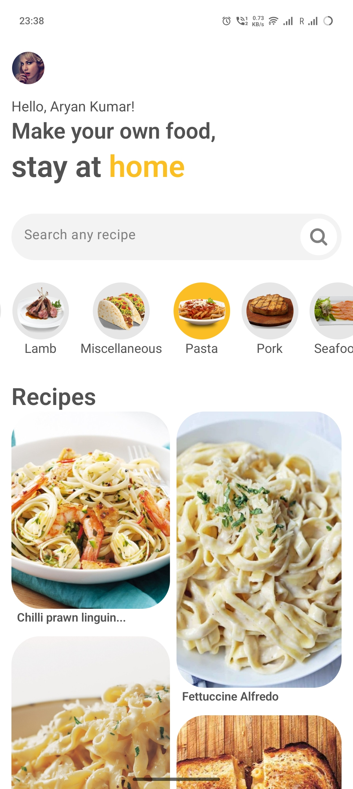
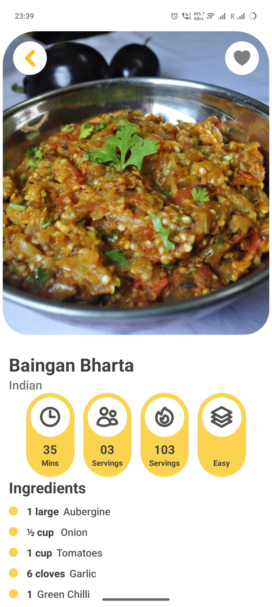
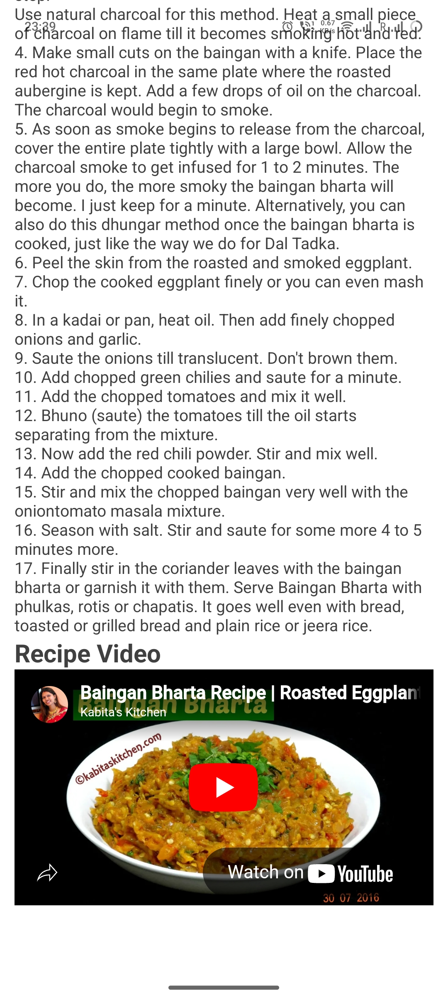
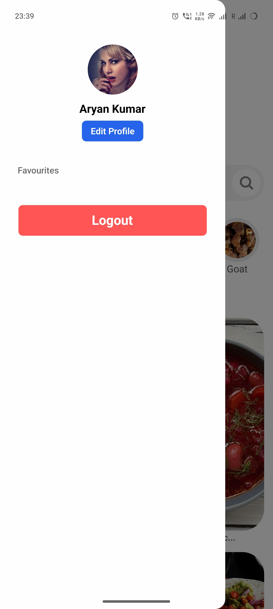
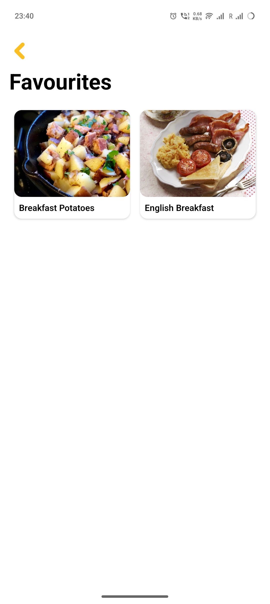

# 🍽️ Recipik – Recipe Sharing App

Recipik is a mobile recipe discovery and sharing application built using **React Native** and **Expo**. It allows users to browse, search, and explore recipes using real-time data from the **MealDB API**, with a smooth and interactive user experience.

---

## ✨ Features

- Browse recipes from different categories  
- Search recipes by name or ingredients  
- View detailed recipe instructions and ingredients  
- YouTube video integration for recipes  
- Local storage for recently viewed recipes  
- Clean and responsive UI  

---

## 🛠 Tech Stack

- React Native  
- Expo  
- JavaScript  
- MealDB API  
- AsyncStorage  

---

## 📱 Screenshots

